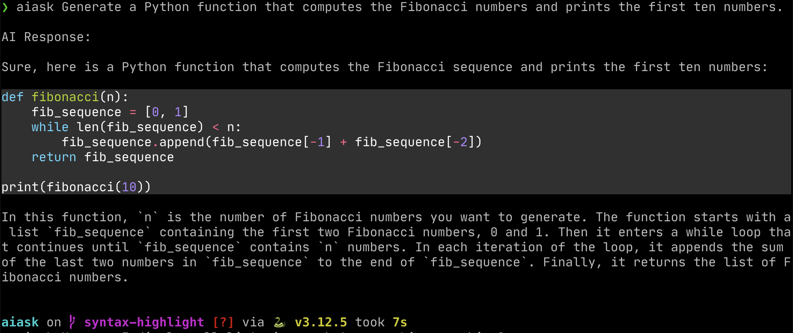

# aiask.py: Your Multi-Provider AI-Powered Copilot

`aiask.py` is a simple, yet powerful command-line tool that leverages multiple AI providers to mimic the GitHub Copilot command-line tool. It now supports OpenAI, Anthropic, Google's Gemini, and OpenRouter.

## Features

* Generates answers to your coding prompts and questions using various AI language models.
* Supports multiple AI providers: OpenAI, Anthropic, Google's Gemini, and OpenRouter.
* Simple to use, with no bells and whistles.
* Uses `litellm` for easy interaction with different AI APIs.
* Allows customization of response length and creativity through command-line options.
* Displays the cost of each API request, helping you track usage and expenses.

## Requirements

* Python 3.7 or higher
* API keys for the AI providers you want to use

## Setup

1. **Install Libraries:** Install the required libraries by running:
   ```bash
   make
   ```

2. **Obtain API Keys:** Create accounts and obtain API keys for the providers you want to use:
   - OpenAI: https://platform.openai.com/
   - Anthropic: https://www.anthropic.com/
   - Google (for Gemini): https://aistudio.google.com//
   - OpenRouter: https://openrouter.ai/

3. **Set API Keys:** Add the following lines to your `~/.bashrc` (or similar) for each provider you want to use:
   ```bash
   export OPENAI_API_KEY=your_openai_api_key
   export ANTHROPIC_API_KEY=your_anthropic_api_key
   export GEMINI_API_KEY=your_gemini_api_key
   export OPENROUTER_API_KEY=your_openrouter_api_key
   ```

4. **Use the aiask script:** Modify the paths in the `aiask` script to match your setup. Move the script to a directory in your PATH. Make the script executable (`chmod +x aiask`).

## Usage

You can now specify which AI provider to use with command-line options, as well as customize the response:

```bash
aiask [--openai|--anthropic|--gemini|--openrouter] [--max-tokens MAX_TOKENS] [--temperature TEMPERATURE] 'Your question here'
```

- If no provider is specified, the script will use the first available API key in the order: OpenAI, Anthropic, Gemini, OpenRouter.
- `--max-tokens`: Set the maximum number of tokens in the response (default: 500).
- `--temperature`: Set the temperature for response generation, controlling creativity (default: 0.2, range: 0.0 to 1.0).

## Examples

1. Using the default provider:
   ```bash
   ❯ aiask 'What is the capital of Cameroon?'

   AI Response (model: gpt-4 , cost: $0.001740):

   The capital of Cameroon is Yaoundé.

   Request cost: $0.000123
   ```

2. Specifying a provider:
   ```bash
   ❯ aiask --gemini "List the five deepest lakes in the world." 

   AI Response (model: gemini/gemini-1.5-flash , cost: $0.000054):

   Here are the five deepest lakes in the world, along with their approximate depths: 

   1. **Lake Baikal (Russia):** 1,642 meters (5,387 feet) 
   2. **Lake Tanganyika (Tanzania, Burundi, Democratic Republic of Congo, Zambia):** 1,470 meters (4,823 feet) 
   3. **Lake Vostok (Antarctica):** 900-1,200 meters (2,953-3,937 feet) - Note: Lake Vostok is a subglacial lake, meaning it is buried under a thick ice sheet.
   4. **Lake O'Higgins/San Martín (Chile/Argentina):** 836 meters (2,743 feet)
   5. **Lake Malawi (Malawi, Mozambique, Tanzania):** 706 meters (2,316 feet)

   Request cost: $0.000045
   ```

3. Using custom max tokens and temperature:
   ```bash
   ❯ aiask --openai --max-tokens 100 --temperature 0.8 "Write a short poem about coding"

   AI Response (model: gpt-4 , cost: $0.007170):

   In realms of logic, we create,
   Lines of code, we orchestrate.
   Bugs and errors, we navigate,
   With each compile, we elevate.
   Syntax dances, algorithms flow,
   In this digital world we grow.
   From simple scripts to complex schemes,
   Coding brings life to our dreams.

   Request cost: $0.000234
   ```

Syntax highlighting is supported for code blocks in the responses.




